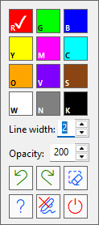

# On Screen Drawing Tool

Lightweight on-screen annotation tool for Windows, built with AutoHotkey v2 and GDI+.

Draw directly on top of any screen with multiple tools (freehand, line, rectangle, ellipse, circle, arrow), configurable hotkeys, and an INI-based settings system. Run it as source (`.ahk`) or as a compiled standalone `.exe`.

## Highlights

- Fast overlay drawing with GDI+ anti-aliased rendering
- Drawing tools: freehand, straight line, rectangle, ellipse, circle, arrow
- Dynamic line width and opacity controls
- Color palette with single-key shortcuts (fully configurable in `settings.ini`)
- Built-in hotkeys help dialog (<kbd>F1</kbd> by default, configurable in `settings.ini`)
- **Undo and Redo** support for all drawing actions, including clearing the screen
- Clear all drawings while in drawing mode with a single key or button
- Right-click in-place settings panel: color picker, line width, opacity, quick actions
- Pen cursor while drawing mode is active
- **Always-on-top** help and info windows that don't get lost behind the overlay
- Multi-monitor support — starts on the monitor the mouse cursor is on
- Per-monitor DPI awareness with multiple fallbacks for mixed-scaling setups
- Shapes are preserved across drawing sessions (within the same monitor)

## Requirements

- Windows
- [AutoHotkey v2.x](https://www.autohotkey.com/) (for source usage only)
- `Gdip_all.ahk` in the same folder as the main script

If you use the compiled `.exe`, **AutoHotkey installation** is not required.

## Quick Start

### Option 1: Run from source

1. Install [AutoHotkey v2](https://www.autohotkey.com/).
2. Keep these files in the same directory:
   - `On Screen Drawing.ahk`
   - `Gdip_all.ahk`
   - `settings.ini` (optional — defaults are applied automatically)
   - `app_icon.ico` (optional — used for the tray icon)
3. Run `On Screen Drawing.ahk`.
4. Press <kbd>Ctrl</kbd>+<kbd>F9</kbd> (default) to start drawing mode.

### Option 2: Run compiled EXE

1. Download the latest release `.exe` from the [Releases](https://github.com/akcansoft/On-Screen-Drawing-Tool/releases) page.
2. Optionally place `settings.ini` next to the `.exe` for custom settings.
3. Run the executable.

## Default Controls

### Global hotkeys (always active)

| Hotkey           | Action                     |
| ---------------- | -------------------------- |
| <kbd>Ctrl</kbd>+<kbd>F9</kbd>        | Toggle drawing mode on/off |
| <kbd>F1</kbd>             | Show hotkeys help          |
| <kbd>Ctrl</kbd>+<kbd>Shift</kbd>+<kbd>F12</kbd> | Exit the application       |

### While in drawing mode

| Hotkey / Action            | Description                    |
| -------------------------- | ------------------------------ |
| <kbd>Esc</kbd>                      | Clear all drawings             |
| <kbd>Backspace</kbd>                | Undo last drawing action (can restore a cleared screen) |
| <kbd>Shift</kbd>+<kbd>Backspace</kbd>          | Redo last undone action        |
| <kbd>XButton1</kbd> (Mouse Back)    | Undo last drawing action (can restore a cleared screen) |
| <kbd>XButton2</kbd> (Mouse Forward) | Redo last undone action        |
| <kbd>Ctrl</kbd>+<kbd>NumpadAdd</kbd>           | Increase line width            |
| <kbd>Ctrl</kbd>+<kbd>NumpadSub</kbd>           | Decrease line width            |
| <kbd>WheelUp</kbd> / <kbd>WheelDown</kbd>      | Increase / decrease line width |
| Right-click on overlay     | Open in-place settings panel   |

### Tool selection (hold modifier before clicking to draw)

| Modifier     | Tool                                       |
| ------------ | ------------------------------------------ |
| *(none)*     | Freehand                                   |
| <kbd>Shift</kbd>      | Straight line                              |
| <kbd>Ctrl</kbd>       | Rectangle                                  |
| <kbd>Alt</kbd>        | Ellipse                                    |
| <kbd>Ctrl</kbd>+<kbd>Alt</kbd>   | Circle (radius = max of X/Y drag distance) |
| <kbd>Ctrl</kbd>+<kbd>Shift</kbd> | Arrow (with auto-sized filled arrowhead)   |

### Color hotkeys (default, configurable in `settings.ini`)

| Key | Color  | Key | Color   | Key | Color |
| --- | ------ | --- | ------- | --- | ----- |
| <kbd>r</kbd> | Red    | <kbd>m</kbd> | Magenta | <kbd>s</kbd> | Brown |
| <kbd>g</kbd> | Green  | <kbd>c</kbd> | Cyan    | <kbd>w</kbd> | White |
| <kbd>b</kbd> | Blue   | <kbd>o</kbd> | Orange  | <kbd>n</kbd> | Gray  |
| <kbd>y</kbd> | Yellow | <kbd>v</kbd> | Violet  | <kbd>k</kbd> | Black |

> Color hotkeys are only active while drawing mode is on and the mouse cursor is on the active monitor.

## Right-Click Settings Panel

Right-clicking anywhere on the overlay opens a compact floating panel that includes:

 

- **Color grid** — shows configured colors in a 3-column grid. The active color is marked with a ✓ checkmark, and hotkey hints are displayed on each swatch by default.
- **Line width** — numeric edit field with up/down spinner (1–10 by default).
- **Opacity** — numeric edit field with up/down spinner (0–255).
- **Quick action buttons:**
  - **Undo** / **Redo**
  - **Clear** — removes all drawings
  - **Help** — shows the hotkeys help dialog
  - **Stop drawing** — exit drawing mode
  - **Exit application**

The panel snaps to within the active monitor's bounds. Press <kbd>Esc</kbd> or click away to close it.

## Tray Menu

Right-clicking the tray icon shows:

- **About** — shows app and author information
- **Hotkeys Help** — displays all active hotkeys
- **GitHub repo** — opens the project repository
- **Open settings.ini** — opens the config file in Notepad
- **Reset to Defaults** — restores original settings
- **Reload Script** — reloads the application
- **Start/Stop Drawing** — toggles drawing mode
- **Exit** — closes the app

## settings.ini Reference

The app reads `settings.ini` from the script/exe directory on startup. Missing keys fall back to defaults. You can reset the file to defaults at any time via the tray menu.

### [Settings] keys

| Key                | Description                         | Default |
| ------------------ | ----------------------------------- | ------- |
| `StartupLineWidth` | Initial stroke width                | `2`     |
| `MinLineWidth`     | Minimum allowed width               | `1`     |
| `MaxLineWidth`     | Maximum allowed width               | `10`    |
| `DrawAlpha`        | Drawing opacity (0–255; 255 = fully opaque) | `200`   |
| `FrameIntervalMs`  | Overlay redraw interval (milliseconds) | `16`    |
| `MinPointStep`     | Min distance for freehand points    | `3`     |
| `ClearOnExit`      | Discard shapes when closing overlay | `false` |
| `ShowColorHints`   | Show hotkey hints on color swatches | `true`  |

### [Hotkeys] keys

| Key                 | Description                | Default      |
| ------------------- | -------------------------- | ------------ |
| `ToggleDrawingMode` | Start/Stop drawing         | <kbd>^F9</kbd>        |
| `ExitApp`           | Close application          | <kbd>^+F12</kbd>      |
| `ClearDrawing`      | Clear all shapes           | <kbd>Esc</kbd>        |
| `UndoDrawing`       | Remove last shape          | <kbd>Backspace</kbd>  |
| `RedoDrawing`       | Restore last removed shape | <kbd>+Backspace</kbd> |
| `IncreaseLineWidth` | Line width +               | <kbd>^NumpadAdd</kbd> |
| `DecreaseLineWidth` | Line width -               | <kbd>^NumpadSub</kbd> |
| `HotkeysHelp`       | Show help window           | <kbd>F1</kbd>         |

## Project Structure

- `On Screen Drawing.ahk` (Main script)
- `Gdip_all.ahk` (Required library)
- `settings.ini` (Config file)
- `app_icon.ico` (Icon)

## Version History

### v1.3.0 08/03/2026

- **UI Enhancement**: Added hotkey hints to the color swatches in the right-click settings panel to improve discoverability.
- **New Setting**: Introduced the `ShowColorHints` option in `settings.ini` to allow users to disable the new color hotkey hints if desired. This is enabled by default.

### v1.2.2 07/03/2026

- **Enhanced Undo/Redo**: Added support for undoing "Clear Drawing" actions, allowing users to restore all shapes after a total clear.
- **Interaction Fixes**: Resolved an issue where the mouse wheel interfered with numeric editboxes in the settings panel; wheel scrolling now correctly adjusts the focused control's value.
- **Code Refactoring & Optimization**: Major internal architecture update, centralizing application state and logic (using a unified `App` object and `DrawingColors` class) for improved reliability and performance.

### v1.2.0 06/03/2026

- **Re-do Support**: Restored shapes are preserved in a stack; added `RedoLastShape` functionality.
- **Mouse Shortcuts**: Fast undo/redo using mouse side buttons (<kbd>XButton1</kbd> and <kbd>XButton2</kbd>).
- **Improved Settings GUI**:
  - Added **Clear Drawing** and **Help** buttons to the panel.
  - Reordered action buttons for better workflow (Help, Exit Drawing, Exit App).
- **UI Fixes**:
  - Help (<kbd>F1</kbd>) and About windows now stay on top and handle focus correctly during drawing (Modal-like overlay behavior).

### v1.1.0 05/03/2026

- Added a configurable `HotkeysHelp` action with <kbd>F1</kbd> as the default shortcut.
- Added `About` and `GitHub repo` items to the tray menu.
- Updated tray menu labels to show the assigned hotkeys for drawing toggle, help, and exit actions.
- Added a pen cursor while drawing mode is active.
- Improved the floating settings panel so it hides and reopens cleanly instead of being recreated each time.
- Improved settings panel state syncing for the selected color, line width, and opacity controls.

### v1.0.0 05/03/2026

- Initial public release.
- Included overlay drawing tools for freehand, line, rectangle, ellipse, circle, and arrow.
- Included configurable hotkeys, color shortcuts, tray menu actions, and `settings.ini` support.

## Troubleshooting

**Nothing happens when pressing the toggle hotkey**
- Check `ToggleDrawingMode` in `settings.ini`.
- Ensure no other application is capturing the same hotkey combination.

**Error about GDI+ or screen capture on startup**
- Verify that `Gdip_all.ahk` exists in the same folder as the script and is compatible with AHK v2.

**Wrong position or scale on multi-monitor / mixed-DPI setups**
- The script applies per-monitor DPI awareness with multiple fallbacks. Restart the app after changing monitor layout or DPI settings.

**Color hotkeys do not work while drawing**
- Confirm all `[Colors]` entries follow the `0xRRGGBB` format.
- Make sure the mouse cursor is on the active drawing monitor — color hotkeys are restricted to that monitor.

**Shapes disappear when re-entering drawing mode**
- Check that `ClearOnExit` is set to `false` in `settings.ini`.
- Note: switching to a different monitor always resets the shape list.

## Contributing

Issues and pull requests are welcome on [GitHub](https://github.com/akcansoft/On-Screen-Drawing-Tool).

When reporting a bug, please include:

- Windows version
- AutoHotkey version (if running from source)
- Your `settings.ini` contents
- Steps to reproduce the issue

## Credits

- [Gdip_all.ahk](https://github.com/buliasz/AHKv2-Gdip/blob/master/Gdip_All.ahk) by [buliasz](https://github.com/buliasz) — GDI+ wrapper library for AutoHotkey v2

## Author

**Mesut Akcan**

- GitHub: [akcansoft](https://github.com/akcansoft)
- Blog: [akcansoft.blogspot.com](https://akcansoft.blogspot.com)
- Blog: [mesutakcan.blogspot.com](https://mesutakcan.blogspot.com)
- YouTube: [youtube.com/mesutakcan](https://www.youtube.com/mesutakcan)
