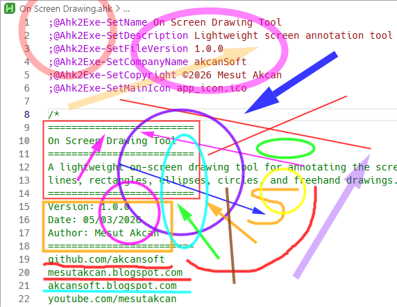
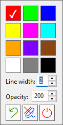

# On Screen Drawing Tool

[](https://www.autohotkey.com/)
[](https://www.microsoft.com/windows)
[](LICENSE)
[](https://github.com/akcansoft/On-Screen-Drawing-Tool/releases)


[](https://github.com/akcansoft/On-Screen-Drawing-Tool/releases)

Lightweight on-screen annotation tool for Windows, built with AutoHotkey v2 and GDI+.

Draw directly on top of any screen with multiple tools (freehand, line, rectangle, ellipse, circle, arrow), configurable hotkeys, and an INI-based settings system. Run it as source (`.ahk`) or as a compiled standalone `.exe`.



## Highlights

- Fast overlay drawing with GDI+ anti-aliased rendering
- Drawing tools: freehand, straight line, rectangle, ellipse, circle, arrow
- Dynamic line width and opacity controls
- Color palette with single-key shortcuts (fully configurable in `settings.ini`)
- Undo last shape and clear all drawings while in drawing mode
- Right-click in-place settings panel: color picker, line width, opacity, quick actions



- Tray icon menu for quick access to all main functions
- Multi-monitor support — starts on the monitor the mouse cursor is on
- Per-monitor DPI awareness with multiple fallbacks for mixed-scaling setups
- Shapes are preserved across drawing sessions (within the same monitor)

## Requirements

- Windows
- [AutoHotkey v2.x](https://www.autohotkey.com/) (for source usage only)
- `Gdip_all.ahk` in the same folder as the main script

If you use the compiled `.exe`, **AutoHotkey installation** is not required.

## Quick Start

### Option 1: Run from source

1. Install AutoHotkey v2.
2. Keep these files in the same directory:
   - `On Screen Drawing.ahk`
   - `Gdip_all.ahk`
   - `settings.ini` (optional — defaults are applied automatically)
   - `app_icon.ico` (optional — used for the tray icon)
3. Run `On Screen Drawing.ahk`.
4. Press `Ctrl+F9` (default) to start drawing mode.

### Option 2: Run compiled EXE

1. Download the latest release `.exe` from the [Releases](https://github.com/akcansoft/On-Screen-Drawing-Tool/releases) page.
2. Optionally place `settings.ini` next to the `.exe` for custom settings.
3. Run the executable.

## Default Controls

### Global hotkeys (always active)

| Hotkey | Action |
|---|---|
| `Ctrl+F9` | Toggle drawing mode on/off |
| `Ctrl+Shift+F12` | Exit the application |

### While in drawing mode

| Hotkey / Action | Description |
|---|---|
| `Esc` | Clear all drawings |
| `Backspace` | Undo last shape |
| `Ctrl+NumpadAdd` | Increase line width |
| `Ctrl+NumpadSub` | Decrease line width |
| `WheelUp / WheelDown` | Increase / decrease line width |
| Right-click on overlay | Open in-place settings panel |

### Tool selection (hold modifier before clicking to draw)

| Modifier | Tool |
|---|---|
| *(none)* | Freehand |
| `Shift` | Straight line |
| `Ctrl` | Rectangle |
| `Alt` | Ellipse |
| `Ctrl+Alt` | Circle (radius = max of X/Y drag distance) |
| `Ctrl+Shift` | Arrow (with auto-sized filled arrowhead) |

### Color hotkeys (default, configurable in `settings.ini`)

| Key | Color |
|---|---|
| `r` | Red |
| `g` | Green |
| `b` | Blue |
| `y` | Yellow |
| `m` | Magenta |
| `c` | Cyan |
| `o` | Orange |
| `v` | Violet |
| `s` | Brown (saddle) |
| `w` | White |
| `n` | Gray |
| `k` | Black |

> Color hotkeys are only active while drawing mode is on and the mouse cursor is on the active monitor.

## Right-Click Settings Panel


Right-clicking anywhere on the overlay opens a compact floating panel that includes:

- **Color grid** — shows all configured colors as clickable swatches; the currently active color is marked with a ✓ checkmark (color automatically contrasted for readability)
- **Line width** — numeric edit field with up/down spinner, clamped to `MinLineWidth`–`MaxLineWidth`
- **Opacity** — numeric edit field with up/down spinner (0–255)
- **Quick action buttons:**
  - Undo last shape
  - Stop drawing (exit drawing mode)
  - Exit application

The panel snaps to within the active monitor's bounds if it would otherwise go off-screen. Press `Esc` or click away to close it.

## Tray Menu

Right-clicking the tray icon shows:

- **Open settings.ini** — opens the file in Notepad
- **Hotkeys Help** — displays all active hotkeys in a message box
- **Reset to Defaults** — overwrites `settings.ini` with built-in defaults and reloads the script
- **Reload Script** — reloads the script (useful after manually editing `settings.ini`)
- **Start Drawing / Stop Drawing** — toggles drawing mode (label updates dynamically)
- **Exit**

## settings.ini Reference

The app reads `settings.ini` from the script/exe directory on startup. Missing keys fall back to defaults. You can reset the file to defaults at any time via the tray menu.

### Default settings.ini

```ini
[Settings]
StartupLineWidth=2
MinLineWidth=1
MaxLineWidth=10
DrawAlpha=200
FrameIntervalMs=16
MinPointStep=3
ClearOnExit=false

[Hotkeys]
ToggleDrawingMode=^F9
ExitApp=^+F12
ClearDrawing=Esc
UndoDrawing=Backspace
IncreaseLineWidth=^NumpadAdd
DecreaseLineWidth=^NumpadSub

[Colors]
r=0xFF0000
g=0x00FF00
b=0x0000FF
y=0xFFFF00
m=0xFF00FF
c=0x00FFFF
o=0xFFA500
v=0x7F00FF
s=0x8B4513
w=0xFFFFFF
n=0x808080
k=0x000000
```

### [Settings] keys

| Key | Description |
|---|---|
| `StartupLineWidth` | Initial stroke width when the app starts |
| `MinLineWidth` | Minimum allowed line width (must be ≥ 1) |
| `MaxLineWidth` | Maximum allowed line width |
| `DrawAlpha` | Drawing opacity, 0 (transparent) to 255 (opaque) |
| `FrameIntervalMs` | Overlay update timer interval in milliseconds (default 16 ≈ 60 fps) |
| `MinPointStep` | Minimum pixel distance between sampled freehand points |
| `ClearOnExit` | If `true`, all shapes are discarded when drawing mode is turned off. Accepts `true`/`false`, `yes`/`no`, `on`/`off`, `1`/`0` |

### [Hotkeys] keys

Use AutoHotkey hotkey syntax. Setting a value to empty disables that hotkey.

| Modifier symbol | Meaning |
|---|---|
| `^` | Ctrl |
| `+` | Shift |
| `!` | Alt |
| `#` | Win |

### [Colors] keys

- Format: `<key>=0xRRGGBB`
- Each entry creates a color hotkey active during drawing mode.
- The **first** color in the list is used as the initial drawing color.
- Any single printable character can be used as the hotkey key; avoid characters that conflict with other hotkeys.

## Performance Notes

- When drawing mode starts, a screenshot of the active monitor is captured as a background buffer.
- Completed shapes are "baked" into a separate off-screen buffer so only the in-progress shape is re-rendered on each frame.
- Anti-aliasing (GDI+ smoothing mode 4) is applied to all rendering.
- Switching to a different monitor resets the shape list and captures a fresh screenshot.

## Project Structure

```
On Screen Drawing.ahk   ← Main application script
Gdip_all.ahk            ← GDI+ helper library (required)
settings.ini            ← Runtime configuration (optional, auto-defaults)
app_icon.ico            ← Tray and taskbar icon (optional)
```

## Troubleshooting

**Nothing happens when pressing the toggle hotkey**
- Check `ToggleDrawingMode` in `settings.ini`.
- Ensure no other application is capturing the same hotkey combination.

**Error about GDI+ or screen capture on startup**
- Verify that `Gdip_all.ahk` exists in the same folder as the script and is compatible with AHK v2.

**Wrong position or scale on multi-monitor / mixed-DPI setups**
- The script applies per-monitor DPI awareness with multiple fallbacks. Restart the app after changing monitor layout or DPI settings.

**Color hotkeys do not work while drawing**
- Confirm all `[Colors]` entries follow the `0xRRGGBB` format.
- Make sure the mouse cursor is on the active drawing monitor — color hotkeys are restricted to that monitor.

**Shapes disappear when re-entering drawing mode**
- Check that `ClearOnExit` is set to `false` in `settings.ini`.
- Note: switching to a different monitor always resets the shape list.

## Contributing

Issues and pull requests are welcome on [GitHub](https://github.com/akcansoft/On-Screen-Drawing-Tool).

When reporting a bug, please include:

- Windows version
- AutoHotkey version (if running from source)
- Your `settings.ini` contents
- Steps to reproduce the issue

## Credits

- [Gdip_all.ahk](https://github.com/buliasz/AHKv2-Gdip/blob/master/Gdip_All.ahk) by [buliasz](https://github.com/buliasz) — GDI+ wrapper library for AutoHotkey v2

## Author

**Mesut Akcan**

- GitHub: [akcansoft](https://github.com/akcansoft)
- Blog: [akcansoft.blogspot.com](https://akcansoft.blogspot.com)
- Blog: [mesutakcan.blogspot.com](https://mesutakcan.blogspot.com)
- YouTube: [youtube.com/mesutakcan](https://www.youtube.com/mesutakcan)
